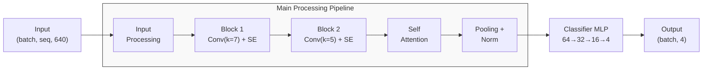

# Rossmann Tool Box Redesign

## Overview
This repository contains the redesign project for Rossmann Toolbox. It modernizes the [rossmann-toolbox](https://github.com/labstructbioinf/rossmann-toolbox) model with improved embedding and updated dependencies to work with Python 3.12. Another aim of this project is to incorporate functionality for structure based prediction which was not available in the previous model.

## Key Advancements
- Complete rewrite with modern deep learning techniques
- Support for latest protein language model embeddings
- Advanced neural architecture with attention mechanisms

## Table of Contents
- [Model Architecture](#model-architecture)
- [Features](#features)
- [Installation](#installation)
- [Usage](#usage)
- [Project Structure](#project-structure)
- [Requirements](#requirements)
- [Contributing](#contributing)
- [License](#license)

## Model Architecture

Our redesigned model consists of two primary components:

### 1. Sequence Classification Module (ModernSeqCoreEvaluator)
This module predicts the cofactor type from protein sequences by processing protein language model embeddings through:
- Residual convolutional blocks with varying kernel sizes (7→5)
- Squeeze-and-Excitation blocks for feature recalibration
- Self-attention mechanism for capturing long-range dependencies
- Hierarchical feature extraction (128→64→32→16→4 dimensions)



### 2. Residue-Level Detector (ModernSeqCoreDetector)
This module identifies critical binding residues within the sequence:
- Per-position processing of embedding features
- Multi-scale convolutional feature extraction
- Self-attention for capturing residue interactions
- Position-specific binary classification (binding/non-binding)

```mermaid
flowchart LR
    input["Input\n(batch, seq, 640)"] --> proj["Linear Projection\n640→128 + Norm"]
    
    subgraph conv_pipeline["Convolutional Pipeline"]
        proj --> trans1["Transpose\n(1,2)"]
        trans1 --> conv1["Conv1D\n128→64, k=7"]
        conv1 --> bn1["BatchNorm\n+ GELU"]
        bn1 --> se1["SE\nBlock"]
        se1 --> conv2["Conv1D\n64→64, k=5"]
        conv2 --> bn2["BatchNorm\n+ GELU"]
        bn2 --> se2["SE\nBlock"]
    end
    
    se2 --> attn["Self\nAttention"]
    attn --> trans2["Transpose\nBack"]
    
    trans2 --> mlp["Classifier MLP\n64→32→16→4→1"]
    mlp --> output["Output\n(batch, seq, 1)"]
    
    classDef blocks fill:#f9f9f9,stroke:#333,stroke-width:1px
    class conv_pipeline blocks
```



## Features
- **Advanced Sequence Analysis**:
  - Cofactor type prediction (NAD, NADP, FAD, ATP)
  - Critical binding residue identification
  - Conserved motif detection

- **Modern Implementation**:
  - PyTorch-based with GPU acceleration
  - Batch processing for high-throughput analysis
  - Attention mechanisms for capturing complex dependencies

- **Structure Integration** (In Development):

  - Process PDB files directly
  - Compatible with AlphaFold predictions
  - Binding site geometry analysis


## Installation
```bash
# Clone the repository
git clone https://github.com/mwilliams619/ross_redesign.git

# Navigate to project directory
cd ross_redesign

# Install dependencies
pip install -e .
```

## Usage

### Getting Started

To start, first create a virtual environment and download requirements:
```bash
# Create and activate virtual environment
python3 -m venv venv
source venv/bin/activate  # On Windows, use: venv\Scripts\activate

# Ensure pip is up to date
pip install --upgrade pip

# Download and install requirements
pip install -r requirements.txt
```

The simplest way to use this model is through our provided inference script located at `src/inference.py`. This script demonstrates how to:

1. Initialize the sequence predictor
2. Generate protein embeddings using ESM models
3. Make predictions on protein sequences
4. Display results with confidence scores

To run the script:

```bash
python src/inference.py
```

### Script Overview

The inference script performs the following steps:

1. **Model Loading**: Loads the pre-trained model weights and initializes the SequencePredictor class with an optional device selection (GPU/CPU).

2. **Embedding Generation**: Uses the ProteinEmbedding class to generate embeddings for input protein sequences using pre-trained protein language models.

3. **Prediction**: Processes the embeddings through our neural network to predict cofactor binding specificity (FAD, NAD, NADP, or SAM).

4. **Results Processing**: Formats the raw predictions into readable output including:
   - Predicted cofactor type
   - Confidence score (probability from 0 to 1)
   - Full probability distribution across all cofactor types

### Customizing Predictions

To customize the inference for your own sequences, modify the test_sequences list in the script:

``` python
test_sequences = [
    'YOUR_SEQUENCE_HERE',
    'ANOTHER_SEQUENCE_HERE'
]
```
You can also change the model path or other parameters by modifying the corresponding variables in the script.

### Example Output

Running the script with the default example sequences produces output like:
```
Sequence 1:
  Predicted: NAD
  Confidence: 0.8234
  All probabilities: ['0.1234', '0.8234', '0.0432', '0.0100']

Sequence 2:
  Predicted: NADP
  Confidence: 0.9012
  All probabilities: ['0.0123', '0.0632', '0.9012', '0.0233']
```
For advanced usage, you can import classes from this script into your own Python applications.


## Project Structure
```
ross_redesign/
└── src/
    ├── inference.py              # Main script for running predictions
    ├── models/                   # Neural network architectures
    │   └── seq_detect.py         # Sequence-based models
    ├── utils/                    # Helper utilities
    │   ├── embeddings.py         # Protein embeddings generation
    │   └── data_processing.py    # Data handling functions
    └── training/                 # Model training code
        └── training_loop.py      # Core training functionality
```
Key components:

    inference.py: Entry point for making cofactor predictions
    models/: Contains the deep learning model architectures
    utils/: Common utilities like embedding generation and data processing
    training/: Code for training new models or fine-tuning existing ones

## Requirements

- Python 3.9+
- PyTorch 2.0+ (with CUDA support recommended for GPU acceleration)
- See `requirements.txt` for complete dependencies


## Contributing
1. Fork the project
2. Create your feature branch: `git checkout -b feature/amazing-feature`
3. Commit your changes: `git commit -m 'Add some amazing feature'`
4. Push to the branch: `git push origin feature/amazing-feature`
5. Open a Pull Request

## License
MIT License

---
Project maintained by Matthew Williams